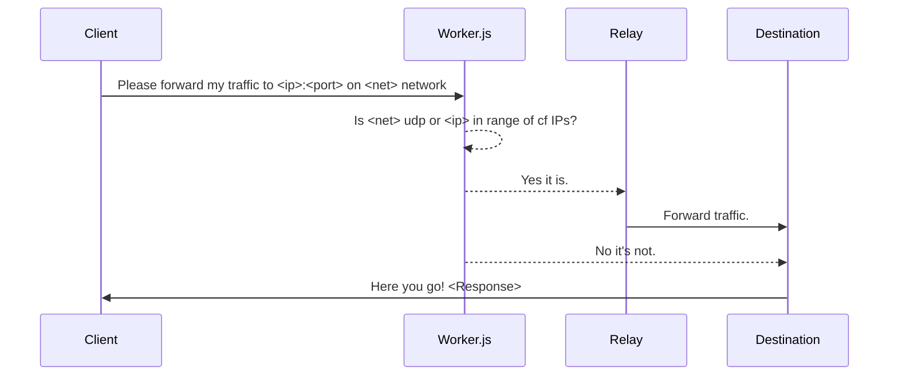

# Bepass Relay

This repository contains a **Relay** for bepass workers that aims for better solutions in terms of **performance** and **features** regarding common worker issues such as supporting **IPv6**, the **UDP protocol**, and more stable communication with Cloudflare IPs (**loopback connections**).

As you know, Cloudflare workers are currently unable to connect to hosts that have Cloudflare IPs (this is considered a loopback).

# Important note

**Attention: Relay deployment is not mandatory to use Bepass!**\
\
If you just want to use Bepass as an anti censorship tool and don't want to be a volunteer maintainer, that works fine for you, we already prepared about 10 public relays, so you don't have to do anything. This is just for people who want to help the project by becoming a volunteer maintainer or make a private relay for themselves.

# How it Works

**Relay nodes** are servers **maintained by volunteer** users. These nodes help the worker support features that are not officially supported by Cloudflare workers.
so if you want to connect to any host behind cloudflare cdn or use udp protocol for purposes such as online voice/video chat or gaming, the worker automatically detects that and forward your 
traffic to a relay node that is maintained by a volunteer user(or yourself if you deploy a relay for yourself). then the relay node will forward your traffic to the destination and send the response back to you.

## How to Make a Cloudflare Worker

Please follow the instructions at [Bepass worker](https://github.com/bepass-org/bepass-worker) repository and make yourself a worker.

## How Does a Relay Node Work?

Here is a representation of what happens to your request from the client to the destination:




## How to Test Its Functionality

It's simple! Just buy a VPS from a provider that offers a lot of traffic, then install Golang and run:

```bash
tmux
git clone https://github.com/bepass-org/bepass-relay.git
cd bepass-relay
go run *.go -b 0.0.0.0 -p 6666 
```

Then press ctrl+b and then d. Then go to your cloudflare dashboard and open your worker with **Quick dit** button. Then change the following lines:

```js  
const proxyIPs = ['<Your IP goes here>'];
const proxyPort = 6666;
let proxyIP = proxyIPs[Math.floor(Math.random() * proxyIPs.length)];
```

Then test that your worker works as intended.

## How to Share My Node? (Becoming a Volunteer Maintainer)

It's simple! Just follow these 3 easy steps:

1. Buy a VPS from a provider that offers a lot of traffic, like Hetzner GMBH. Then install Golang and run:

   ```bash    
   sudo su
   cd /opt
   git clone https://github.com/bepass-org/bepass-relay.git
   cd bepass-relay
   CGO_ENABLED=0 go build -ldflags '-s -w' -trimpath *.go
   ```

2. Make a systemd service for Bepass in **/etc/systemd/system/cfb.service**:

   ```bash
   nano /etc/systemd/system/cfb.service
   ```

   And paste the following code:
      ```
   	[Unit]
   	Description=Bepass Relay Service
   	
   	[Service]   
   	ExecStart=/opt/bepass-relay/relay
   	
   	[Install]
   	WantedBy=multi-user.target
      ```
   Then reload systemd to read this unit file with:
      ```bash
   	systemctl daemon-reload
      ```
   Start the service with:
      ```bash
   	systemctl start cfb.service
      ```
   And enable it during startup with:
      ```bash
   	systemctl enable cfb.service
      ```
   You can check the status of the service with:
      ```bash
   	systemctl status cfb.service
      ```
3. Submit a new issue with the **Volunteer Node Maintainer** title and share your server IP address and how long your server will last! (Minimum requirement: at least 3 months)

# Progress

- [x] Implement Relay
- [x] Implement worker's range detection
- [x] Better loopback support
- [x] Full IPv6 support
- [x] Full UDP support

## License

MIT Public License
