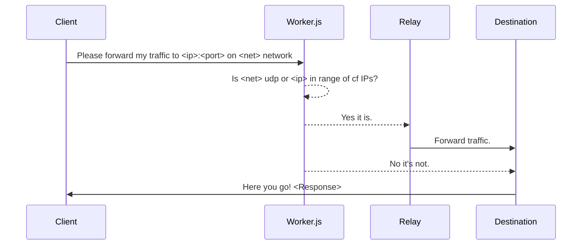

# Bepass Advanced Worker and Relay

This repository contains a new **worker.js** that aims for better solutions in terms of **performance** and **features** regarding common worker issues such as supporting **IPv6**, the **UDP protocol**, and more stable communication with Cloudflare IPs (**loopback connections**).

As you know, Cloudflare workers are currently unable to connect to hosts that have Cloudflare IPs (this is considered a loopback).

# How This Works

It aims to fix bugs from the previous version and improve its functionality with the help of **relay nodes**.

## How to Make a Cloudflare Worker

1. Sign up at the [Cloudflare signup page](https://www.cloudflare.com/sign-up)
2. From the main navbar, choose **Workers & Pages**
3. Click the **Create Application** button
4. Click the **Create Worker** button
5. Copy the worker.js file contents from this repository
6. Fill in a name for your worker and click the **Deploy** button
7. Click the **Quick Edit** button
8. Paste your clipboard contents and replace the worker's default code
9. Click the **Save and Deploy** button
10. Write down the newly created worker address, it should be something like **[name].[username].workers.dev**
11. Change your Bepass configuration to **https://[name].[username].workers.dev/dns-query**

## What is a Relay Node?

Relay nodes are servers **maintained by volunteer** users. These nodes help the worker support features that are not officially supported by Cloudflare workers.

## How Does a Relay Node Work?

Here is a representation of what happens to your request from the client to the destination:




## How to Test Its Functionality

It's simple! Just buy a VPS from a provider that offers a lot of traffic, then install Golang and run:

```bash
tmux
git clone https://github.com/uoosef/cf-bepass.git
cd cf-bepass
go run relay.go -b 0.0.0.0 -p 6666 
```

Then press ctrl+b and then d. Then edit the worker.js:

```js  
/**
* Welcome to Cloudflare Workers! This is your first worker.    
*
* - Run "npm run dev" in your terminal to start a development server   
* - Open a browser tab at http://localhost:8787/ to see your worker in action
* - Run "npm run deploy" to publish your worker
*
* Learn more at https://developers.cloudflare.com/workers/
*/

// @ts-ignore
import { connect } from 'cloudflare:sockets';

const proxyIPs = ['<Your IP goes here>'];
const proxyPort = 6666;
let proxyIP = proxyIPs[Math.floor(Math.random() * proxyIPs.length)];
```

Then test that your worker works as intended.

## How to Share My Node? (Becoming a Volunteer Maintainer)

It's simple! Just follow these 3 easy steps:

1. Buy a VPS from a provider that offers a lot of traffic, like Hetzner GMBH. Then install Golang and run:

   ```bash    
   sudo su
   cd /opt
   git clone https://github.com/uoosef/cf-bepass.git
   cd cf-bepass
   go build relay.go
   ```

2. Make a systemd service for Bepass in **/etc/systemd/system/cfb.service**:

   ```bash
   nano /etc/systemd/system/cfb.service
   ```

   And paste the following code:
      ```
   	[Unit]
   	Description=CF Bepass Service
   	
   	[Service]   
   	ExecStart=/opt/cf-bepass/relay
   	
   	[Install]
   	WantedBy=multi-user.target
      ```
   Then reload systemd to read this unit file with:
      ```bash
   	systemctl daemon-reload
      ```
   Start the service with:
      ```bash
   	systemctl start cfb.service
      ```
   And enable it during startup with:
      ```bash
   	systemctl enable cfb.service
      ```
   You can check the status of the service with:
      ```bash
   	systemctl status cfb.service
      ```
3. Submit a new issue with the **Volunteer Node Maintainer** title and share your server IP address and how long your server will last! (Minimum requirement: at least 3 months)

# Progress

- [x] Implement Relay
- [x] Implement worker's range detection
- [x] Better loopback support
- [ ] Full IPv6 support
- [ ] Full UDP support

## License

MIT Public License
